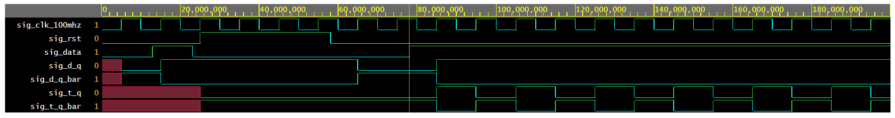

# Lab 5: Roman Křivánek

### D & T Flip-flops

1. Screenshot with simulated time waveforms. Try to simulate both D- and T-type flip-flops in a single testbench with a maximum duration of 200 ns, including reset. Always display all inputs and outputs (display the inputs at the top of the image, the outputs below them) at the appropriate time scale!

   

### JK Flip-flop

1. Listing of VHDL architecture for JK-type flip-flop. Always use syntax highlighting, meaningful comments, and follow VHDL guidelines:

```vhdl
architecture Behavioral of jk_ff_rst is
    signal sig_q : std_logic;
begin
 p_jk_ff_rst : process (clk)
    begin
        if rising_edge(clk) then  -- Synchronous process
            if(rst='1') then
                sig_q<='0';
           	elsif(J='0' and K='0') then
                sig_q <= sig_q;
            elsif(J='0' and K='1') then
            	sig_q <='1'; 
            elsif(J='1' and K='0') then
             	sig_q <='0';
            else 
               	sig_q<= not sig_q; 
             end if;                 
        end if;
        q<=sig_q;
        q_bar<=not sig_q;
    end process p_jk_ff_rst;
end Behavioral;
```

### Shift register

1. Image of the shift register `top` level schematic. The image can be drawn on a computer or by hand. Always name all inputs, outputs, components and internal signals!

   
